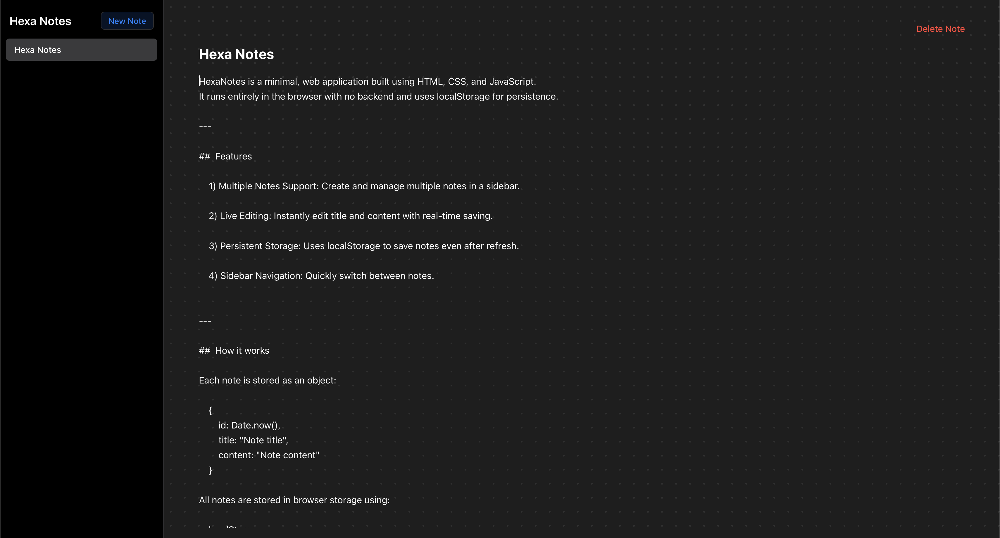

#  HexaNotes

HexaNotes is a minimal, web application built using HTML, CSS, and JavaScript.  
It runs entirely in the browser with no backend and uses localStorage for persistence.

---

##  Features

    1) Multiple Notes Support: Create and manage multiple notes in a sidebar.

    2) Live Editing: Instantly edit title and content with real-time saving.

    3) Persistent Storage: Uses localStorage to save notes even after refresh.

    4) Sidebar Navigation: Quickly switch between notes.

---

##  How it works

Each note is stored as an object:

    {
        id: Date.now(),
        title: "Note title",
        content: "Note content"
    }

All notes are stored in browser storage using:

    localStorage

This allows data to persist without any backend.

---

## Tech Stack

    - HTML5
    - CSS3
    - Vanilla JavaScript (no frameworks)

---

## Installation

To run HexaNotes locally:

    git clone https://github.com/Hexa-Programmer/HexaNotes.git
    cd HexaNotes
    open index.html

---

## Why I built this

This project was built to practice:

    - DOM manipulation
    - State management in vanilla JS
    - localStorage persistence
    - building real multi-component UI systems

---

##  Note

This is a personal learning project and will continue to evolve over time.

---

Made with ❤️ by Hexa